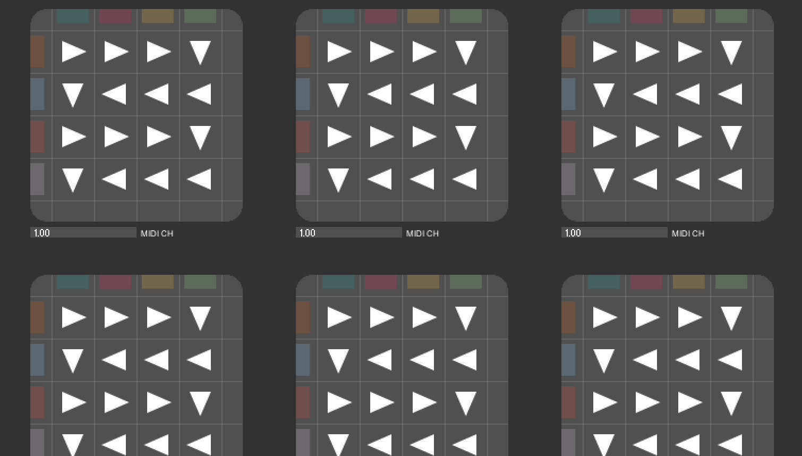

# AV_EXP &middot; [](http://makeapullrequest.com)

> :art: :pencil: These examples can be used for any course in audio visual art (Processing/Pd).

[demo](https://vibertthio.github.io/av_exp/)



## 0. Table of Contents  
- [Download](#1-download)
- [Dependencies](#2-dependencies)
- [Run](#3-run)

## 1. Download

First, clone the project. Or you can just download as .zip.
```
git clone https://github.com/vibertthio/av_exp.git av_exp
cd av_exp
```

## 2. Dependencies
You need to download several dependencies in Processing IDE.
If you have on idea how to download Processing libraries, you can follow the [instruction](https://github.com/processing/processing/wiki/How-to-Install-a-Contributed-Library) in Processing's wiki page.


## 3. Run

Second, open the folder you are want to try and open the files with Processing IDE.
